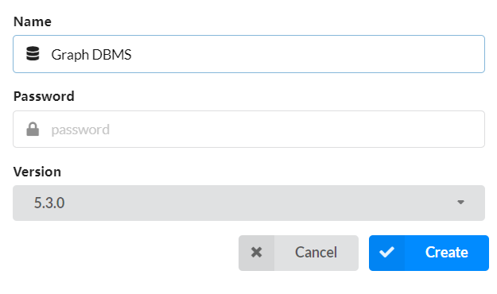
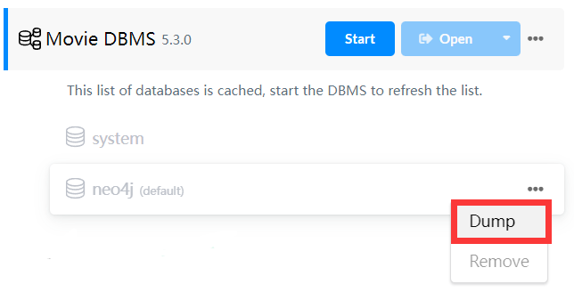
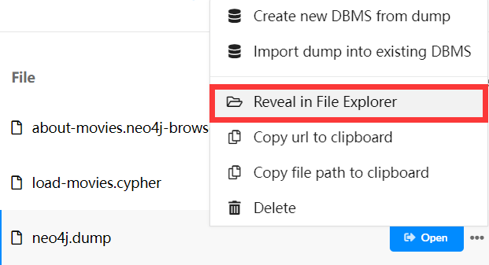
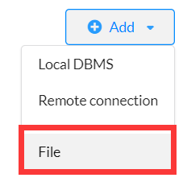
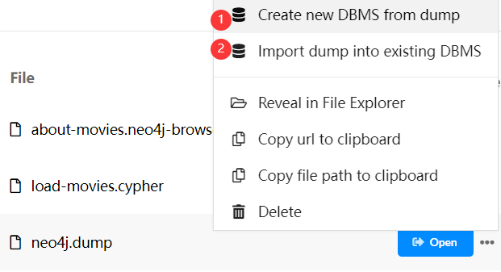
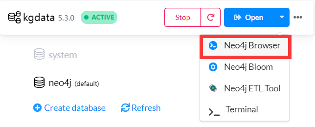
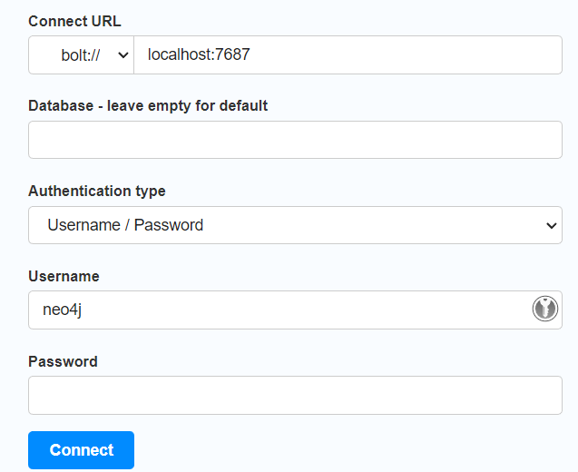
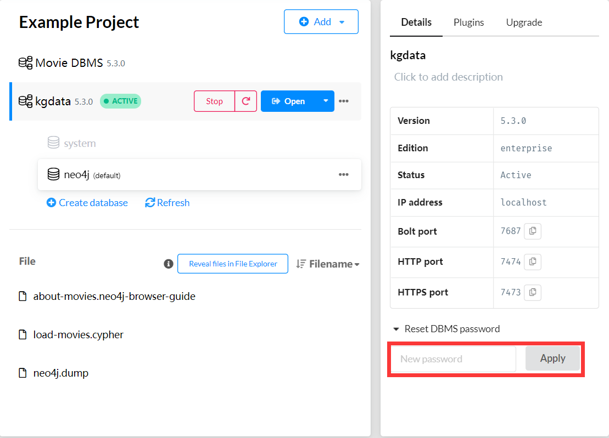
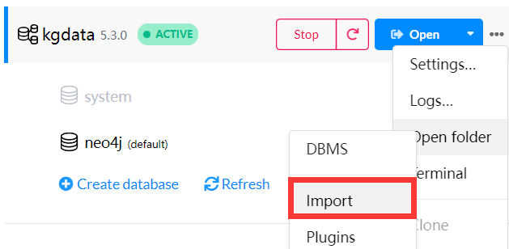

# Neovis.js可视化Neo4j数据库

# Neo4j Desktop

## 新建数据库

​

​​​

## 导出数据库

​

查看文件位置

​​

## 导入数据库

添加dump文件

​

导入数据库，这里有两个选项，①选项是新建一个DBMS并将数据导入默认数据库neo4j，②选项是导入一个已有的DBMS并新建一个数据库来导入数据，因为用neovis.js可视化的时候，我没找到指定数据库的方法，所以只能连接默认数据库，但是我又没找到切换默认数据库的方法，因此如果导入dump文件，只能选择①

​​​

# Neo4j Browser

Neo4j Browser是Neo4j官方数据库操作工具，start DBMS之后，点击Open，默认使用Neo4j Browser打开，其实用电脑浏览器打开[http://localhost:7474](http://localhost:7474)是一样的效果

​

浏览器打开的时候，登录信息如下图所示，用户名默认为neo4j，密码是创建DBMS是设置的，如果忘记密码可以点击相应的DBMS名称，然后在右侧重置

​

​

## CSV数据

### 节点数据

poi.csv

```python
id,lon,lat,address,type2,type1,name
1,100.01,10.01,x,type21,type11,name1
2,100.02,10.02,y,type22,type12;atm,name2
3,100.03,10.03,z,type23,type13;atm,name3
```

roads.csv

```python
FID,length,point1,point2
6,160,"100.011,10.011","100.022,10.022"
8,10,"100.022,10.022","100.033,10.033"
10,40,"100.033,10.033","100.044,10.044"
```

### 关系数据

poi_rel_road.csv

```python
poi_id,relation,fid
1,located,6
2,located,8
3,located,10
```

connected.csv

```python
road1_id,relation,road2_id
6,connected,8
8,connected,10
```

# Cypher语句

相当于MySQL数据库的SQL语句

### 切换数据库

```sql
use database
```

### 插入数据

插入节点和关系数据

```sql
CREATE (person:Person { name: 'Alice', age: 30 })
CREATE (friend:Person { name: 'Bob', age: 40 })
CREATE (person)-[:FRIEND]->(friend)
```

Person: 节点标签

name: 节点属性 age: 节点属性

FRIEND: 节点和节点之间的关系

### 插入CSV数据

将CSV文件放到相应DBMS的import文件夹中

​​​

然后在Neo4j Browser中执行以下语句

```sql
LOAD CSV WITH HEADERS FROM "file:///poi.csv" AS row
CREATE (:poi {id: row.id, lon: row.lon, lat: row.lat, address: row.address, type2: row.type2, type1: row.type1, name: row.name})
```

```sql
LOAD CSV WITH HEADERS FROM "file:///roads.csv" AS row
CREATE (:road {fid: row.fid, length: row.length, point1: row.point1, point2: row.point2})
```

```sql
LOAD CSV WITH HEADERS FROM 'file:///poi_rel_road.csv' AS line
MATCH (p:poi {id: line.poi_id}), (r:road {FID: line.fid})
CREATE (p)-[:CONNECTED_TO {relation: line.relation}]->(r)
```

```sql
LOAD CSV WITH HEADERS FROM 'file:///connected.csv' AS row
MATCH (r1:road {FID: row.road1_id}), (r2:road {FID: row.road2_id})
CREATE (r1)-[:CONNECTED {relation: row.relation}]->(r2)
```

### 查询数据

任意100个节点和它们之间的关系

```sql
MATCH (n)-[r]-(m)
WITH n, r, m, rand() AS random
ORDER BY random
LIMIT 100
RETURN n, r, m
```

# Neovis.js

## 目录结构

```shell
.
├── dist
│   ├── neovis.js
│   └── neovis.js.map
└── neovis.html
```

## neovis.html

```html
<!doctype html>
<html>
<head>
    <title>知识图谱</title>
    <style type="text/css">
        html, body {
            font: 16pt arial;
        }

        #viz {
            width: 1500px;
            height: 700px;
            border: 1px solid lightgray;
            font: 22pt arial;
        }

    </style>

    <!-- FIXME: load from dist -->
    <script type="text/javascript" src="./dist/neovis.js"></script>
    <!-- <script src="https://unpkg.com/neovis.js@2.0.2"></script> -->


    <script
            src="https://code.jquery.com/jquery-3.2.1.min.js"
            integrity="sha256-hwg4gsxgFZhOsEEamdOYGBf13FyQuiTwlAQgxVSNgt4="
            crossorigin="anonymous"></script>

    <script type="text/javascript">
        // define config car
        // instantiate nodevis object
        // draw

        var viz;

        function draw() {
            var config = {
                containerId: "viz",
                neo4j: {
                    // 社区版Neo4j只能使用DBMS的默认数据库，即neo4j
                    serverUrl: "bolt://localhost:7687",
                    serverUser: "neo4j",
                    serverPassword: "12345678"
                },
                // 节点
                labels: {
                    road: {
                        // label是需要显示在节点上的属性
                        label: "fid",
                        // size是节点的大小，根据属性的值来决定
                        size: "length"
                    },
                    poi: {
                        label: "name",
                        // group是节点的分组，根据属性的值来决定
                        group: "type2"
                    }
                },
                // 关系
                relationships: {
                    CONNECTED: {
                        label: "relation"
                    },
                    LOCATED: {
                        label: "relation"
                    }
                },
                arrows: true,
                // 初始的Cypher语句，随机显示100条数据
                initialCypher: "MATCH (n)-[r]-(m) WITH n, r, m, rand() AS random ORDER BY random LIMIT 100 RETURN n, r, m"
            };

            viz = new NeoVis.default(config);
            viz.render();
            console.log(viz);

        }
    </script>
</head>
<body onload="draw()">
<div id="viz"></div>

</body>
</html>
```

# 参考

1. [知乎：手把手教你快速入门知识图谱 - Neo4J教程](https://zhuanlan.zhihu.com/p/88745411)
2. [Github：neovis.js](https://github.com/neo4j-contrib/neovis.js)
3. [Github：Neo4j图数据可视化 —— 之Neovis.js篇](https://github.com/shinyzhu/neo4j-advocacy-content/blob/main/docs/2022-07/neo4j-visulization-neovis-intro.md)

‍
