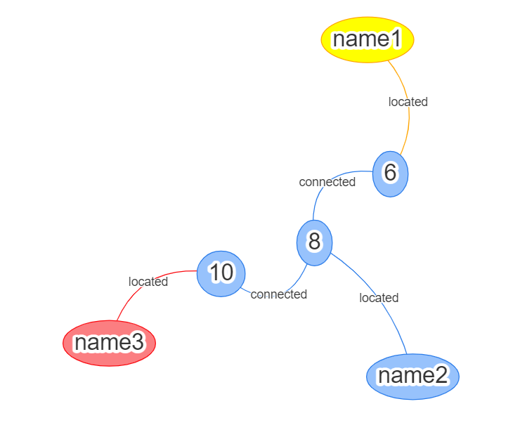

# Neovis.js-Neo4j-Visualization

Neovis.js-Neo4j可视化

​

# 使用

## 下载整个项目文件

## 安装Neo4j Desktop

## 导入数据

参考`Neovis.js-Neo4j-Visualization.md`导入`neo4j.dump`**数据库文件**

或参考`Neovis.js-Neo4j-Visualization.md`新建数据库，使用Cypher语句导入**CSV数据**

## 启动数据库

## 浏览器打开neovis.html
